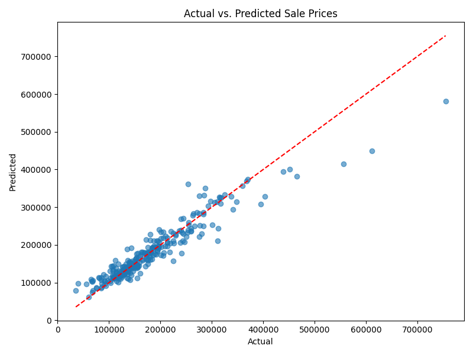

# 🏡 Housing Price Prediction - Ames Dataset

This project builds a machine learning pipeline to predict home sale prices using the **Ames, Iowa Housing Dataset**. It walks through the full data science workflow: from exploratory data analysis to feature engineering, model training, evaluation, and visualization.

> 🔗 [View the full project on GitHub](https://github.com/tnecnivng/Housing-Price-Prediction)

---

## 📌 Overview

- **Goal**: Predict `SalePrice` using housing attributes
- **Tech**: Python, scikit-learn, pandas, matplotlib, seaborn
- **Approach**: Regression models
- **Best Model**: Random Forest Regressor
- **Test R² Score**: 0.8925  
- **Test RMSE**: 28,715

---

## 🧠 Workflow

### 1. 📊 EDA (`notebooks/eda.ipynb`)
- Visualized target distribution
- Checked missing data
- Correlation heatmap with top features

### 2. 🛠 Feature Engineering (`features.ipynb`)
- Dropped high-missing columns (>40%)
- Imputed missing values
- One-hot encoding for categoricals
- StandardScaler on numerics
- Saved train/test sets to `/data/`

### 3. 🤖 Modeling (`modeling.ipynb`)
- Models trained:
  - Linear Regression
  - Ridge Regression
  - Random Forest
- Evaluated using RMSE
- Best model saved with `joblib` to `/outputs/models/`

### 4. 📈 Evaluation (`evaluation.ipynb`)
- Loaded model and test set
- Final RMSE and R² score
- Visualized actual vs predicted prices

---

## 📁 Project Structure

Housing-Price-Prediction/
├── data/ # Raw and processed data
├── notebooks/ # Jupyter notebooks
├── outputs/
│ ├── charts/ # Visualizations
│ └── models/ # Saved model (.pkl)
├── requirements.txt
└── README.md

---

## 📷 Sample Output

---

## 🚀 Tech Stack

- Python 3
- pandas, NumPy
- scikit-learn
- matplotlib, seaborn
- joblib

---

## 🙋‍♂️ Author

**Vincent Nguyen**
B.S. in Applied Mathematics – UCLA  
Aspiring Data Scientist | Passionate about ML pipelines, predictive modeling, and clean code  
🔗 [LinkedIn](www.linkedin.com/in/vincentnguyenvn)

---

## 📝 License

MIT License – for personal use, learning, and portfolio sharing.
